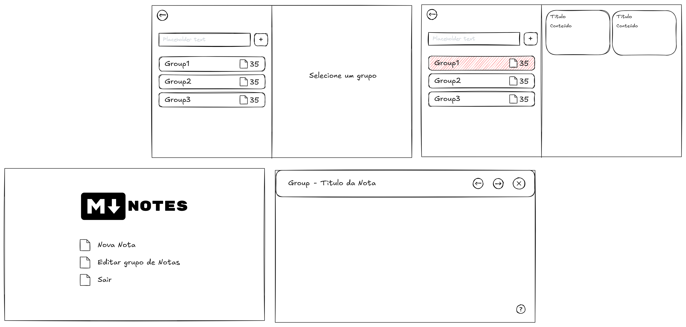
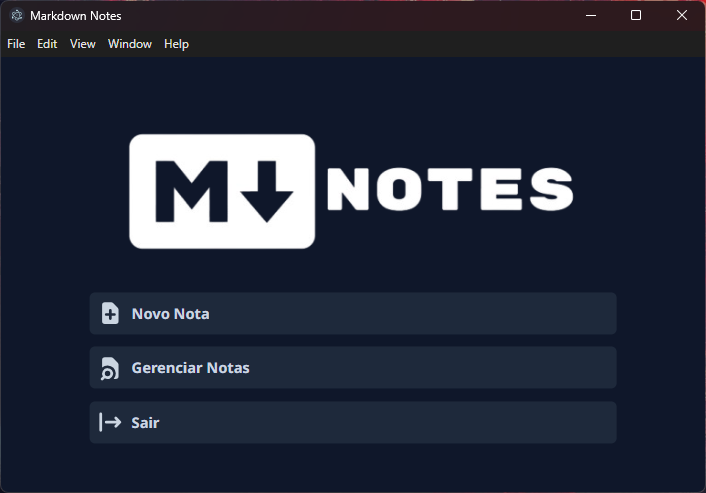
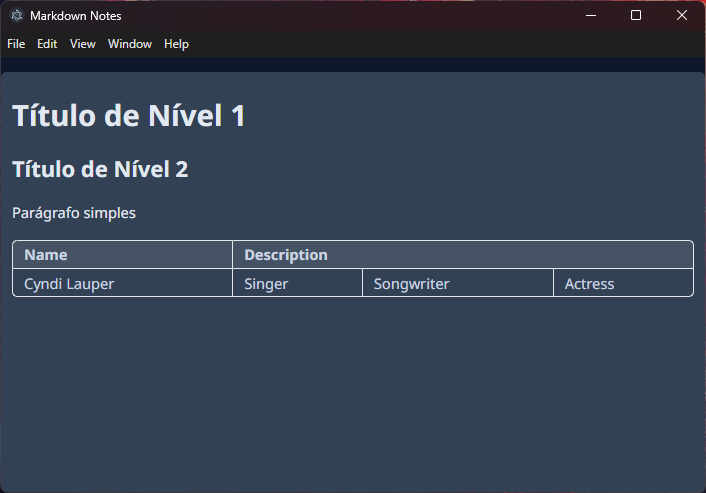
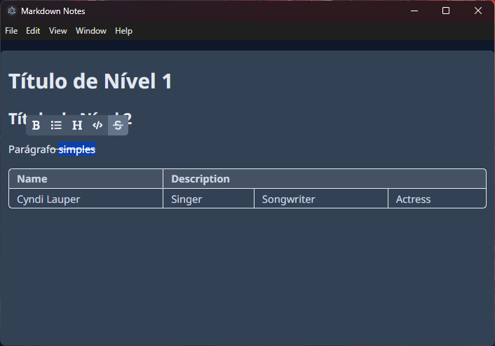

<h1 align="center">
    
</h1>

# 📝 MarkdownNotes

Bloco de notas multiplataforma para você organizar suas ideias com facilidade

<h2 align="center">
  
  
</h2>

## Índice

          
  <a href="#descrição"> Descrição e motivação </a> &nbsp; &nbsp; &nbsp; | &nbsp; &nbsp; &nbsp;
  <a href="#visuais-e-telas"> Visuais e Telas </a> &nbsp; &nbsp; &nbsp; | &nbsp; &nbsp; &nbsp;        
  <a href="#tecnologias">Tecnologias </a> &nbsp; &nbsp; &nbsp; | &nbsp; &nbsp; &nbsp;        
  <a href="#instalação"> Instalação e Funcionalidades </a> &nbsp; &nbsp; &nbsp; | &nbsp; &nbsp; &nbsp;        
  <a href="#issues"> Issues </a>  &nbsp; &nbsp; &nbsp; | &nbsp; &nbsp; &nbsp;  
  <a href="#referências"> Referências </a>  &nbsp; &nbsp; &nbsp; | &nbsp; &nbsp; &nbsp;   

## Descrição          

O MarkdownNotes é um bloco de notas multiplataforma, desenvolvido com TypeScript, React e Electron, que permite criar e organizar anotações de forma simples e eficiente. Com suporte para Markdown, ele facilita a formatação do conteúdo, tornando-se uma excelente ferramenta para programadores, escritores e qualquer pessoa que precise de um ambiente moderno para registrar ideias.

### 🎯 Motivo

Durante meu estágio, precisei realizar diversos testes para garantir que tudo funcionava como esperado. No processo, percebi que muitos softwares de anotações não ofereciam suporte a funcionalidades mais avançadas, como a criação de tabelas em Markdown.
Diante desse desafio, decidi desenvolver meu próprio bloco de notas, incorporando esses recursos para tornar a experiência de anotações mais completa e eficiente 🚀.  

## Visuais e Telas 

  

  
  
  

## Tecnologias                                

| Descrição | tecnologias |
|---------|:-----------:|
|Ideia e Prototipação de tela|  |
|**A escolha da stack**|    |

### Funcionalidades

#### Tela Inicial
- [x] Estrutura Básica da tela inicial
- [x] Redirecionamento ao clicar nos botões da tela Inicial
- [ ] Resposividade para janelas menores

#### Editor
- [x] Editor WYSIWYG funcional com suporte a Markdown
- [x] BubbleMenu
- [x] FloatingMenu
- [x] Salvamento do conteúdo da nota em arquivo externo
- [x] Leitura da nota em arquivo externo
- [x] Resposividade para janelas menores
- [ ] Janela customizada

#### Gerenciador de grupo de notas
- [x] Estilização inicial
- [ ] Leitura de notas salvas
- [ ] Abertura de qualquer nota para o editor
- [ ] Procura por grupo de notas
- [ ] Resposividade para janelas menores

## Instalação   

1. Clone o repositório executando o comando : `git clone https://github.com/Gabriel-Sousa-Dev/MarkdownNotes.git`.
2. Acesse a pasta onde o repositório foi instalado.
3. Execute o comando `npm install` no terminal.
4. Execute `npm run dev:react` para executar a aplicação em seu navegador.
5. Execute `npm run build` para fazer o build do Frontend.
6. Execute `npm run dev:electron` para executar a aplicação no Sistema Operacional.

> [!CAUTION]
> O comando `npm run dev:electron` utiliza os arquivos que estão na pasta `/dist-react/`. Portanto, é essencial realizar o build do Front-End usando `npm run build` antes de testar a aplicação no Electron.
         

## Issues

> Sinta-se à vontade para registrar um novo problema com o respectivo título e descrição no repositório. 
> Se você já encontrou uma solução para seu problema, adoraria revisar sua solicitação de pull!
 
## ***Referências***

* Tecnologias
    - [Typescript](https://laravelcollective.com/tools/banner)
    - [Electron](https://www.electronjs.org/pt/)

* Bibliotecas
    - [Vite](https://vite.dev/)
    - [React Router](https://reactrouter.com/)
    - [Ark UI](https://ark-ui.com/) 
    - [PandasCSS](https://panda-css.com/)
    - [TipTap](https://tiptap.dev/)

* Ícones
    - [React Icons](https://react-icons.github.io/react-icons/)

Gostou? Deixe uma estrelinha para ajudar o projeto ⭐

- [Voltar ao Início](#index)
